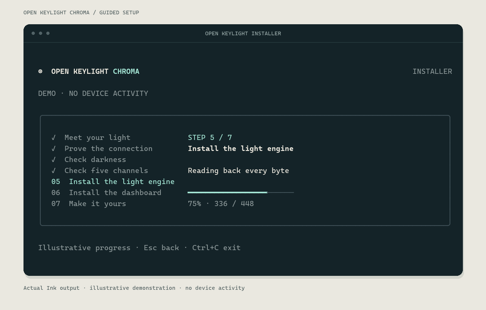

<div align="center">

# Open Keylight Chroma

**Your light. Your firmware. Your studio.**

Open firmware for the Razer Key Light Chroma. A dashboard on the light, an API for everything around it, and no cloud account between you and the switch.

[Get started](docs/getting-started.md) · [Releases](https://github.com/StormBurpee/open-keylight-chroma/releases) · [API](docs/api-contract.md) · [Home Assistant](docs/home-assistant.md) · [Stream Deck](integrations/streamdeck/README.md)

</div>

---

Set the warmth of your key light. Pick a background colour. Save the scene and close the tab. Everything runs on the panel—including the dashboard.

Open Keylight replaces the applications on **both the ESP32 and the NXP lighting controller**. It keeps the existing power electronics, bootloaders and partition layout. Once installed, the light works without a desktop service, Razer software or an internet connection.

> **Early access.** The first installer release is being qualified. Hardware support currently covers the reviewed Key Light Chroma board and stock firmware profile; broad compatibility and long-term electrical testing remain open. [Installation status and recovery limits →](docs/getting-started.md)


## Make it yours

**Light that follows your controls.** Warm and cool white, RGB with sRGB decoding by default, instant changes, adjustable smooth colour transitions and effects. All five output channels use one state model.

**Scenes worth keeping.** Four starting scenes, eight saved slots, and a physical double press to move through them. Your scenes stay on the light.

**A button with a job.** Press to toggle power, double press for the next scene, hold for three seconds to open pairing. Recording Lock protects your lighting during a take; Off remains available.

**Made to connect.** A versioned local HTTP API, MQTT discovery for Home Assistant, and a Stream Deck plugin for keys and dials. Requests, reported controller state and rejected commands are distinct, so integrations can tell you what happened.

**Updates you can see.** Gentle breathing moves from blue through cyan to green as an update progresses, with red pulses on failure. Image checks and a confirmation window guard application updates; recovery limits are documented.


*Dashboard screenshots captured from a light running both original applications.*

## Get started

The guided installer is built with React and Ink. It finds your light, prepares a verified recovery image from Razer's official download, checks the hardware, and walks through installation. Firmware and dashboard files travel together in the release bundle.



*Actual Ink output in demonstration mode; the example progress does not describe a live installation.*

1. Connect your Key Light Chroma to your local network and close other lighting controllers.
2. Follow the [installation guide](docs/getting-started.md) for the current release status and supported starting firmware.
3. Stay with the light for the dark and five-colour checks. The installer explains each observation before continuing.
4. Open the light's local address. Pair the browser and start using it.

The Windows launcher prepares its own portable Node and Python runtimes. It does not change your PATH or require a compiler. Those runtimes and the stock recovery image are downloaded during setup; everyday control stays local.

Already installed? Use the firmware controls in **System**. See [updating an existing installation](docs/getting-started.md#update-an-existing-installation) before changing either application.

## Build on the API

Read device information without an account:

```sh
curl http://LIGHT_IP/api/v1/device
```

Control requires a paired device token. The [API guide](docs/api-contract.md) and [OpenAPI document](docs/openapi.json) cover state, transitions, effects, scenes, pairing, integrations and updates. Revision checks let clients avoid overwriting a newer change.

| Integration | Setup |
| --- | --- |
| Home Assistant | [MQTT discovery and broker configuration](docs/home-assistant.md) |
| Stream Deck | [Install the plugin and connect keys or dials](integrations/streamdeck/README.md) |
| Your own tools | [HTTP API and authentication](docs/api-contract.md) |

## Under the hood

| Area | What lives there |
| --- | --- |
| `firmware/` | ESP-IDF application, networking, persistence and portable control core |
| `firmware-nxp/` | Cortex-M0 lighting application and hardware diagnostics |
| `dashboard/` | React interface embedded in the ESP image |
| `installer/` | React / Ink setup experience |
| `integrations/` | Home Assistant and Stream Deck support |
| `tools/` | Migration, artifact verification and release packaging |
| `tests/` | State, protocol, failure-path and packaging regressions |

Start with the [architecture](docs/architecture.md), [colour rendering](docs/color-rendering.md) and [release process](docs/releasing.md). The [development record](PROGRESS.md) keeps detailed test evidence and unresolved hardware questions out of the user guide.

### Build and test

Use ESP-IDF **5.5.5**, Node.js **22 or newer**, Python **3.12 or newer**, and CMake with a C compiler and cJSON. The NXP build also needs Clang and LLVM with Cortex-M0 support. On Ubuntu, install `libcjson-dev clang lld llvm` for the host/controller tools.

```sh
cmake -S . -B build/host
cmake --build build/host
ctest --test-dir build/host --output-on-failure
python3 -m unittest discover -s tests/migration -p 'test_*.py'

cd dashboard
npm ci
npm test
npm run build
cd ../firmware
idf.py build
```

The dashboard build supplies the assets embedded by the ESP build. For interface development, run `npm run dev` in `dashboard` and use `?demo=1`; the labelled demo sends no device requests. In `installer`, run `npm ci` once, then `npm run start` for guided setup. It automatically selects a prepared local release from `build/release`; see the [installer guide](installer/README.md) for build selection and development checks.

**Use application-only OTA on an existing light.** `idf.py flash` also writes bootloader and partition data and is not the migration procedure. The default NXP qualification build is inert; the installer uses separately reviewed diagnostic and lighting packages.

## Compatibility and care

The panel is one RGB light with two white channels, not individually addressable pixels. Colour and brightness values are control levels, not calibrated optical measurements. Existing output limits stay in place pending electrical and thermal measurements.

The retained ESP bootloader does not provide automatic crash rollback. Application fallback needs the new application to run; an early boot failure can require physical serial recovery. Use the documented [installation and recovery procedure](docs/getting-started.md), and keep the previous known-good image.

Use the HTTP dashboard on a trusted LAN. Pairing tokens authenticate requests but do not encrypt them. MQTT supports broker TLS with certificate validation.

## Contributing

Small, well-tested changes are welcome. Describe the failure or feature, include a reproducer where useful, and distinguish software checks from hardware observations. New board variants need their own qualification record. Changes to output limits need measurements.

This repository contains original application source and dependency lockfiles. Vendor firmware, extracted code, device credentials and private captures are excluded. The implementation is informed by hardware investigation; it is not a clean-room claim.

## License

[Apache-2.0](LICENSE). Razer and Key Light Chroma are trademarks of their respective owners. This project is independent and is not affiliated with or endorsed by Razer.
