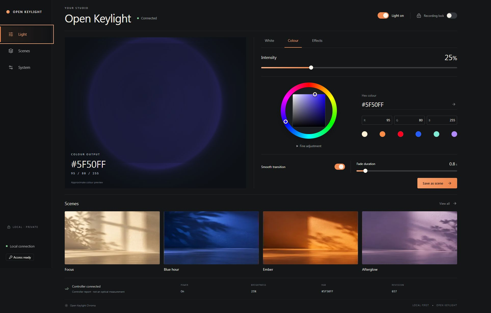
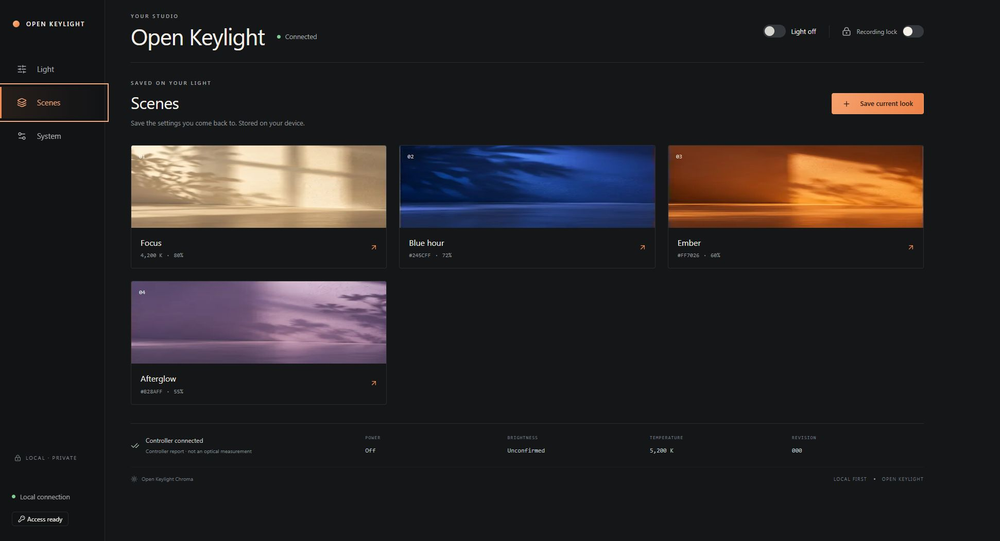

<div align="center">

# Open Keylight Chroma

**Your light. Your firmware. Your studio.**

Independent firmware for the Razer Key Light Chroma, built around local control, a useful physical button, and an API that treats a light like a dependable piece of equipment.

[Getting started](docs/getting-started.md) · [Architecture](docs/architecture.md) · [API](docs/api-contract.md) · [Dashboard](docs/dashboard.md) · [Development record](PROGRESS.md)

</div>

---

Open a browser. Set the warmth of your key light, settle on a background colour, save the scene, and close the tab. The light should keep doing its job.

Open Keylight Chroma is being built to replace **both** applications inside the panel: the ESP32 network controller and the NXP LED controller. It preserves the original power electronics, cooling and installed bootloaders. The ESP implementation also speaks the existing NXP protocol, providing a useful compatibility stage while the independent LED firmware is qualified.

> **Development preview.** Original source and automated tests are available; public installation is not yet qualified. A successful build is not a claim of hardware safety, measured colour accuracy or production readiness. See the development record for exactly what has run on a device.

Both original applications have been installed on the reference light. Native OTA, the OFF1 all-off handoff, the LOW1 five-channel sequence and their resident-loader recovery paths have been exercised; low-level lighting controls have also passed. High-output colour subsequently caused ESP brownout resets. Recovery and PWM handoff changes are under qualification, and the cause is not established. **Full-output reliability and a reproducible stock-to-original installation remain pending.** See [installation and recovery limits](docs/getting-started.md) before using a build on hardware.

## A small instrument, carefully made

- **A dashboard on the light.** React, TypeScript and local shadcn/ui components, compressed into the ESP application. No cloud account, CDN or desktop control service.
- **One control model.** White, RGB, brightness, transitions, bounded effects and eight saved scenes share the same validation path. Recording Lock protects output changes while always allowing Off.
- **An API you can build on.** Versioned JSON, revision checks, explicit errors, pairing tokens, controller reports and a bounded history of changes. A command acknowledgement is distinguished from a getter-confirmed setting.
- **Useful integrations.** Home Assistant through MQTT discovery; a small Stream Deck plugin uses the same HTTP API. Availability and rejected commands are visible.
- **A physical escape route.** Single press toggles power, double press advances a saved scene, and a deliberate hold opens pairing. Button servicing does not depend on the browser.
- **Updates with a clear boundary.** Application-only OTA, image and digest validation, preserved partition layout, and a trial confirmation window. The existing ESP bootloader has no automatic crash rollback; the application-level fallback cannot rescue a failure before application startup.



Browser captures from the reference light running both original applications. The colour wheel, fade controls and controller report all use its local API.



These four defaults and any scenes you save live on the device.

## What is in the tree

| Directory | Responsibility |
| --- | --- |
| `firmware/` | ESP-IDF application, networking, persistence and platform adapters |
| `firmware/components/keylight_core/` | Portable state validation and time-based rendering |
| `firmware/components/keylight_nxp/` | Original bounded SPI protocol driver and button state machine |
| `firmware-nxp/` | Original Cortex-M0 application and LED-controller qualification work |
| `dashboard/` | Embedded interface and browser tests |
| `integrations/` | Thin clients around the public API |
| `tests/` | Host-side protocol, state and failure-path tests |
| `tools/` | Reproducible asset and release tooling |

The repository contains original application source, interface documentation and dependency lockfiles. Extracted vendor binaries, decompiler exports, device credentials and private network captures are excluded. This is an independently written implementation informed by hardware investigation; it is not presented as a clean-room reimplementation.

## Build and test

ESP32 builds are pinned to **ESP-IDF 5.5.5**. Use Node.js 22 or newer for the dashboard and CMake with a C compiler and cJSON development package for portable tests (`libcjson-dev` on Ubuntu). The Stream Deck plugin runs on Stream Deck 7.0 or newer using the host application's Node 20 runtime.

```sh
cmake -S . -B build/host
cmake --build build/host
ctest --test-dir build/host --output-on-failure

cd dashboard
npm ci
npm test -- --run
npm run build
cd ../firmware
idf.py build
```

The dashboard build produces a manifest of four compressed assets, including the scene photography. The ESP build embeds those assets and enforces the existing 1,572,864-byte application slot. **Do not use `idf.py flash` on an installed light:** its newly built bootloader and partition table are not part of the application-only migration.

CI produces development artifacts, not qualified releases. Its ESP archive contains only the application image, matching ELF, build metadata, asset manifest and SHA-256 checksums. It checks the image descriptor against `VERSION` so a stale CMake version cannot silently label a different build. See [artifact verification](docs/getting-started.md#development-artifacts).

For dashboard development, run `npm run dev` in `dashboard` and open the displayed URL with `?demo=1`. The demo has a persistent label, uses an isolated transport and is excluded from production device builds.

## The engineering boundary

The panel is one logical RGB light with two white channels. It is not a strip of individually addressable pixels. Colour values and brightness are control levels, not optical measurements. The existing mixed-mode brightness constraints are retained until electrical and thermal measurements justify a change.

Wi-Fi outages must leave the light state and credentials intact. Animation must not write flash. A stale command must not resurrect an old effect. Shared NVS must never be erased as an error-recovery shortcut. Those rules are part of the architecture, not optional polish.

The current local HTTP interface is intended for a trusted LAN; pairing tokens do not encrypt traffic. MQTT supports broker TLS with certificate validation. Do not expose the device directly to the public internet.

## Contributing

Small changes with a clear failure case are welcome. Include a reproducer, the tests you ran, and any hardware claims that remain unmeasured. Keep protocol logic portable and avoid adding an abstraction until it has a job.

Hardware variants need their own qualification record. Do not infer board support from the product name alone, and do not raise PWM or combined-channel limits without measurements.

## License and affiliation

Apache-2.0. See [LICENSE](LICENSE). Razer and Key Light Chroma are trademarks of their respective owners. This project is independent and is not affiliated with or endorsed by Razer.
